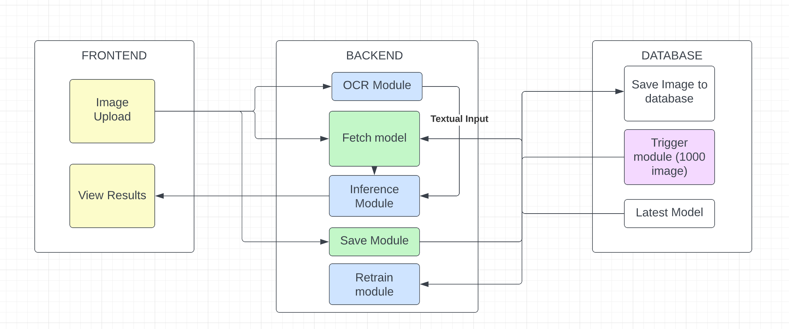
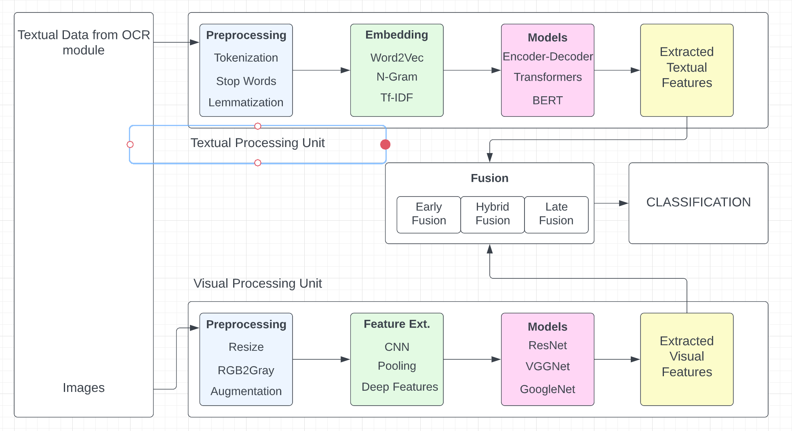

# Tasks
- [ ] Sampling
- [ ] DataLoader
- [ ] Model Building with checkpoints and early stopping
- [ ] BERT pretrained model selection
- [ ] Transfer Learning for BERT
- [ ] Look at encoder-decoder algorithms (for visual and textual features both)

# Introduction
End-to-end multimodal fusion-based hateful meme classi- fication is a machine learning project that aims to develop a model capable of classifying memes that contain hateful or offensive content. The project uses a combination of computer vision, natural language processing, and multimodal fusion techniques to extract and integrate visual content and text features from memes into a single representation. The trained model can be deployed to a production environment to detect and classify hateful memes in real-time. The project’s goal is to provide a robust and efficient solution for detecting and mitigating harmful content on social media platforms.

Today, the internet is bourgeoning with social media ap- plications all around. These social media applications include applications for both personal use like Instagram, Twitter etc. and community based applications like Reddit, Stack Overflow etc. Memes have become an integral part of these social medias. Amongst these memes, there have been a lot of cases of cyber bullying. Thus, this project aims at creating a demostration to classify the memes as hateful or offensive. The project aims at understanding the hidden meaning of interpretation of combined textual and visual features.
# Motivation
Multimodal hateful meme classification is a chal- lenging task that involves identifying and classifying memes con- taining hate speech or offensive content using multiple modalities such as text, images, and videos. This task is difficult because hateful memes can take various forms and combinations of modalities. Deep learning models can be used to learn repre- sentations from multiple modalities and integrate them to make a prediction. Pre-trained models such as BERT, RoBERTa, or GPT-3 can also be fine-tuned on a dataset of hateful memes to improve their performance. It has various applications lwhich includes third party api integration for social media applications like Twitter, Instagram, Stack Overflow, Reddit etc.
# Generic Architecture
Traditional architcture that do not perform well in the domain include unimodal architecture that process only either image or text in the image and give bad results. However, recent studies have shown the success of multimodal architectures that combine the meaning of text with the content in the image.

As a result, even though there are slight variations, the generic architecture of the majority of multimodal models remain the same. The general architecture has two types of flows i.e Linguistic processing flow (LPF) and visual processing flow (VPF). There is always an integrating phase which is called fusion and pre-training phase (FPT) which defined strategies for merging LPF and VPF. The merging phase is usually the part of the architecture that provides a decision.

### Linguistic Processing Flow (LPF)
* Four steps include preprocessing, feature engineering, dimensionality reduction and classification.
* Preprocessing incldues stop words removal, capitalization, tokenization, abbreviation handling, spelling correction, noise removal, stemming and lemmatization.
* Feature engineering includes word embeddings like word2vec, glove, n-gram, bag of words, tf-idf etc.
* Dimensionality reduction includes PCA, LDA, ICA etc.
* For 1G LPF model selection includes choice likfe SVM, knn, naive bayes etc.
* For 2G LPF model selection includes neural network based models like BERT, GPT, LSTM
* Attention layers including transformer, encoders and decoders are also used to normalize the calculated matching score between query vector and each context vector among all vectors using softmax.

### Visual Processing Flow (VPF)
* Feature extraction methods like LBP, SIFT, HOG,SURF, BRIEF etc have been used.
* Various pretrained models like AlexNet, GoogleNet, VGG etc having the capabillity of transfer learning has changed the course of VPF.
* Furthermore, the recent advances in DenseNet reformulated the connections between network layers that further boost the learning and representational properties of deep networks.

### Fusion and Pre-training
* Three categories includin early fusion, late fusion and hybrid fusion.
* Early fusion merges the features instantly after they are extracted.
* Late fusion integrates the decisions after each modality has taken its decision.
* Hybrid fusion fuse outpus from individual unimodal predictors.

# System Architecture

# Deep Learning Component Architecture

# Dataset
Download the following two datasets from kaggle.
1. [Facebook Hatefull Meme Challenge](https://www.kaggle.com/datasets/parthplc/facebook-hateful-meme-dataset)
2. [MMHS150K](https://www.kaggle.com/datasets/victorcallejasf/multimodal-hate-speech)

Once the dataset is downloaded, extract the zip folders and place them in the a directory called "data". Make sure that the names of the two folders are "facebook" and "MMHS150K".